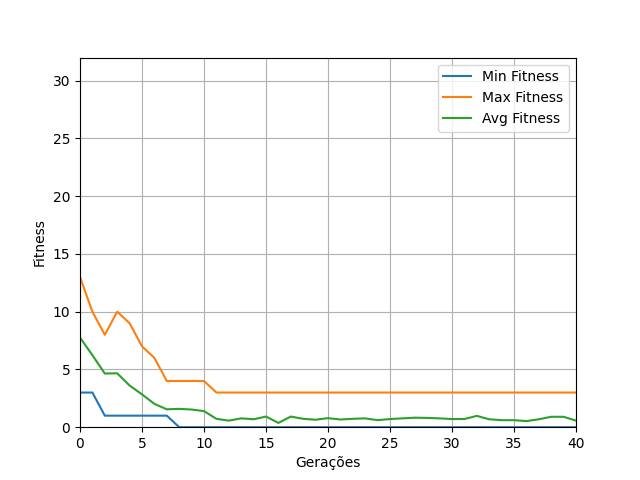

Nome | Cartão | Turma
---|:---:|:---:
Fernando Zanutto | 00302340 | A
Gabriel Fagundes da Fonseca | 00301151 | A
Rodrigo Bervig Rocha | 00301709 | A

# 8-queens (parâmetros que resultaram no gráfico):
- Nº gerações: 40
- Nº indiívduos: 50
- Nº participantes do torneio: 10
- Prob mutação: 0.4
- Elitismo: Sim

# Alegrete:
- Theta_0: 0
- Theta_1: 0
- Alpha: 0.1
- Num_iterations: 500
- EQM: 0.575

